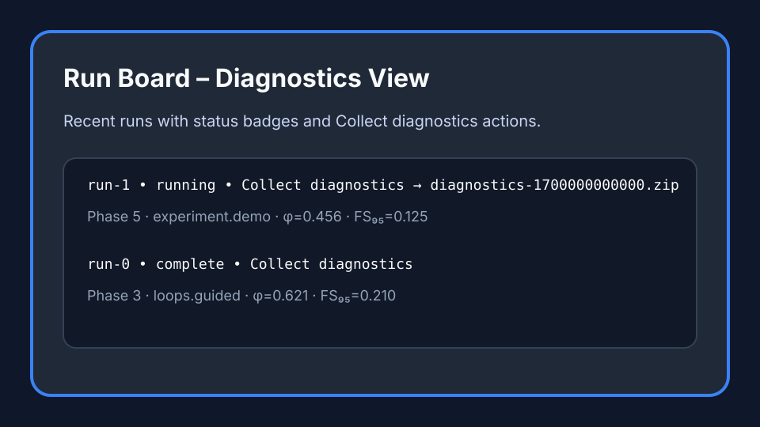
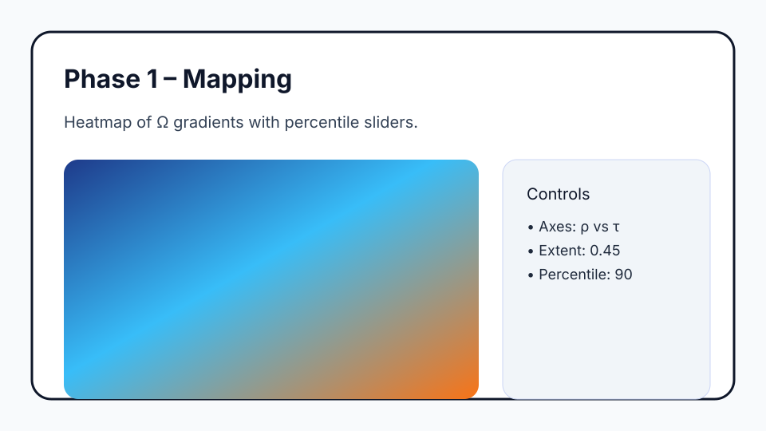
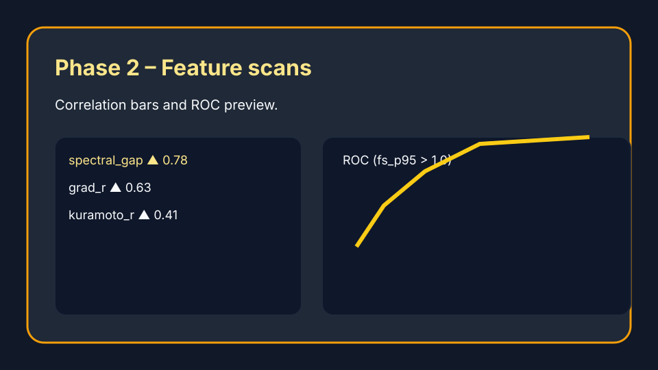
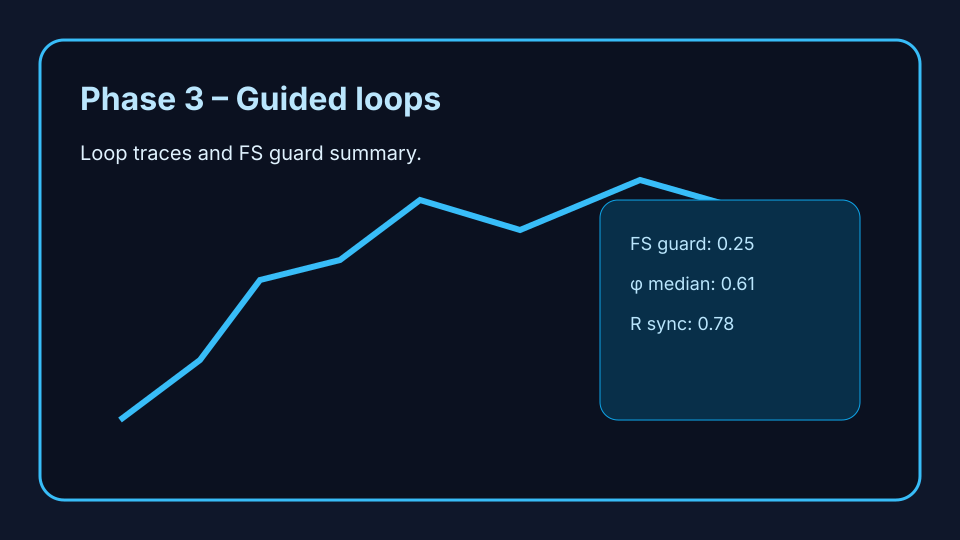
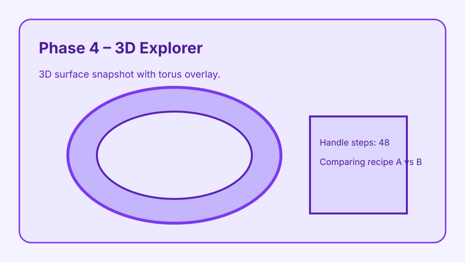
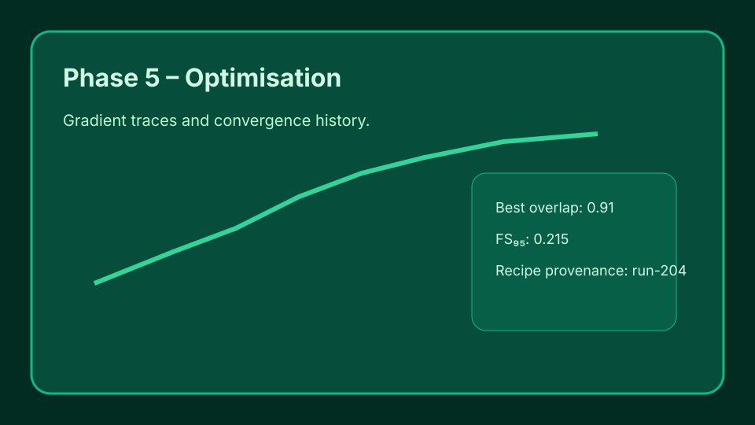
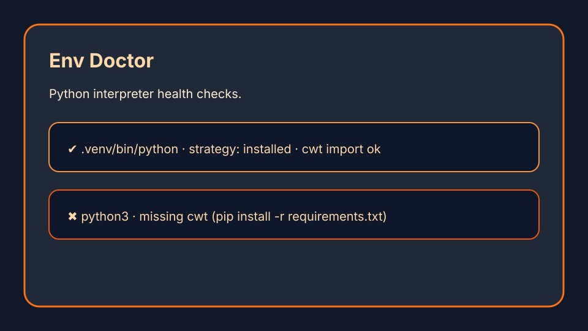

# CWT Lab – User Guide

Welcome to the Curvature Workflow Toolkit (CWT) Lab. This guide walks through each phase of the calibration
journey, explains the telemetry terms that appear across the UI, and documents the built-in troubleshooting
playbook.

## Reading the metrics at a glance

- **FS (Fubini–Study) distance**: measures how far the quantum state jumps between loop steps. Think of it as
  the stride length of the climb—short strides (low FS) keep the system stable while tall spikes mean the loop
  is stumbling.
- **Φ (phi)**: reports the curvature of the ridge you are following. Values near zero indicate a flat plateau;
  larger magnitudes signal a steep ridge or valley.
- **R (readout bias)**: tracks the curvature-induced preference of the classical readout. Values near 1 indicate
  a strong bias toward the hotspot orientation; values closer to 0 signal a balanced, ambiguity-prone readout.

These three metrics appear across the Run Board, diagnostics logs, and per-phase dashboards. Keep them in mind
when deciding whether to tighten guards or adjust parameters.

## Phase walkthrough

### Run Board – monitor and collect diagnostics

The Run Board lists the most recent calibrations along with phase labels, experiments, last-update timestamps,
and a **Collect diagnostics** button. Use this button when support asks for logs—the UI will produce a ZIP
bundle containing stdout, `diagnostics.json`, and environment metadata.

### Phase 1 – Mapping

Phase 1 sweeps the Ω landscape to highlight promising regions. Adjust the extent and percentile guards on the
right. Warm tiles indicate steep gradients worth sampling in later phases.

### Phase 2 – Feature scans

Phase 2 correlates scalar features against the FS threshold you choose. Bars coloured in gold signal strong
positive influence on the guard, and the ROC preview shows how cleanly the classifier separates hot from cold
regions.

### Phase 3 – Guided loops

Phase 3 loops around hot spots using the axes and amplitudes you select. The trace overlays Φ, FS, and R so you
can tell whether the guard is holding while the ridge curves. Watch for FS spikes mid-loop—they usually mean
one of the axes needs tightening.

### Phase 4 – 3D explorer

Phase 4 renders the torus plateau and overlays candidate handles. Compare against a known 2D recipe to see if
the 3D lift uncovers new structure or merely confirms a flat patch.

### Phase 5 – Optimisation

Phase 5 drives a full optimiser over the ridge. The convergence trace shows FS and overlap improving. Export
results once improvements plateau to avoid drift.

### Env Doctor – interpreter health

The Env Doctor inspects candidate Python interpreters. Green badges mark interpreters that can import `cwt` or
fall back to the module-based strategy. Orange/red cards detail what failed so you can patch dependencies. While
the scan runs the status line at the top of the panel cycles through each diagnostic step so you know the
application is still working. Use **Browse…** next to the Python executable field to pick the interpreter on
disk—handy when pointing the lab at a Windows virtual environment or a freshly-installed interpreter.

## Troubleshooting

- **FS spikes**: When FS distance suddenly climbs, reduce the loop amplitude or tighten the guard in Phase 3.
  If spikes persist, revisit Phase 1 to map a broader region—the ridge may be kinked or split.
- **Φ ≈ 0**: A flat φ suggests you are on a plateau. Increase the extent in Phase 1 to hunt for a steeper
  gradient or switch axes in Phase 3 to tilt the loop towards a new direction.
- **Import errors in Env Doctor**: Use the **Set Python Path** option to point to the virtual environment you
  prepared with `pip install -r requirements.txt` and `pip install -r requirements.test.txt`. The diagnostics
  panel will show the exact import failure to guide additional installs.

## Collecting diagnostics for support

1. Open the Run Board and locate the run in question.
2. Click **Collect diagnostics**. The button will disable while the archive is created.
3. When the notice displays the ZIP path, open the artifacts directory on disk and share the file with support.

The archive includes the stdout/stderr capture, the structured `diagnostics.json` with timestamps in UTC, and a
snapshot of the detected Python environment.
