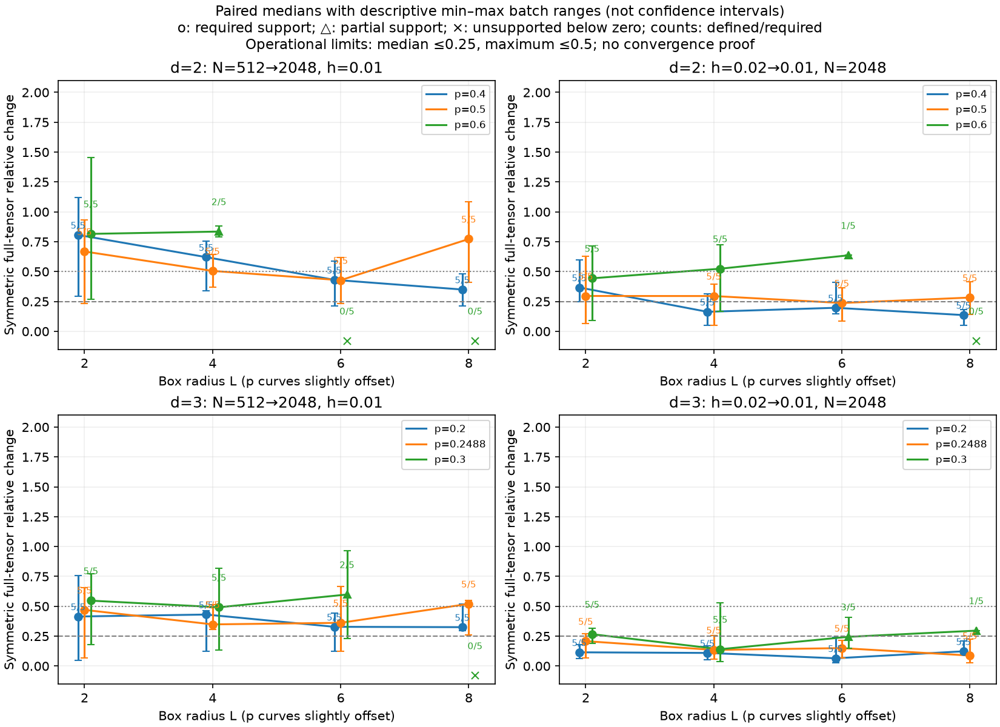

# Paired finite percolation study

Run status: complete.

descriptive limited variation at tested resolutions; unsupported/undefined cases indeterminate; no confidence interval, convergence proof, exponent, theorem, or CWT validation

The source theorem θ(p_c)=0 concerns infinite independent nearest-neighbor bond percolation on Z^d, d≥2, newly resolved for 3–10. Finite boxes provide no CWT validation. [Pinned primary release](https://github.com/anthropics/formal-math/blob/795efb86f191735c5481675763537cfb4ff37e55/percolation/README.md) reports machine verification, not independent human review; the proof kernel was not rerun here. It gives no exact 3D threshold or exponent.

2D bond p_c=0.5 is exact only for the undamaged square lattice. 3D ≈0.2488 is a rounded numerical reference, not exact criticality ([source](https://doi.org/10.1103/PhysRevE.87.052107)).

Model/event: independent Bernoulli nearest-neighbor edges in nonperiodic [-L,L]^d; the origin reaches Chebyshev shell L. Different radii are different finite observables, not discretization convergence tests. The real square-root shell state has Ω=0; metric changes measure encoding sensitivity, not Berry-curvature emergence.

Measurement duplicates are verified across four children, reported once, and never pool. Wilson95 intervals are pointwise, not simultaneous bands. Geometry uses no smoothing. Tensor change includes signed g_uv. Zero denominators and missing pairs are indeterminate. All required pairs in both comparisons and all fine batches must be accepted. Median .25 and maximum .50 are operational descriptive limits, not confidence intervals or proof.

Recorded 24/24 cases. [Profile](profile.json) SHA256 `0138edc16711597088cf10811eda2017dc3227cf4cf04112bb7e2b73e38b2e7c`; [protocol](protocol.json) SHA256 `664197c9cee68daeb96bb4fc300232cb2416b29855c22682acc68cca1a681b8a`; both frozen before children.

```json
{"chart": "u axis-0 bonds; v remaining axes; forward corners; measured u=v=p", "dimensions": [2, 3], "geometry_batches": 5, "geometry_trials": [512, 2048], "interpretation": "descriptive limited variation at tested resolutions; unsupported/undefined cases indeterminate; no confidence interval, convergence proof, exponent, theorem, or CWT validation", "maximum_change_tolerance": 0.5, "measurement_duplicates": "identical N2048 stream in children; verify equal, report once, never pool", "measurement_trials": 2048, "median_change_tolerance": 0.25, "min_overlap": 0.9, "pairing": "keyed geometry seed shared across N/h; N shares uniform prefixes; h shares uniforms; independent batches", "primary_comparisons": ["N512 versus2048 at h0.01", "h0.02 versus0.01 at N2048"], "probabilities_2d": [0.4, 0.5, 0.6], "probabilities_3d": [0.2, 0.2488, 0.3], "radii": [2, 4, 6, 8], "relative_tensor_change": "2*Frobenius(B-A)/(Frobenius(A)+Frobenius(B)); zero denominator indeterminate", "required_joint_batches": 5, "seed": 20261002, "state_map": "real sqrt of raw origin-cluster maximum-shell histogram; no smoothing", "steps": [0.01, 0.02], "study_id": "percolation-convergence-20261001-v1"}
```

Serial execution bounds the largest uniform array near 227 MB decimal, excluding validation temporaries. [STATUS.json](STATUS.json) retains per-child and total elapsed seconds through reporting, excluding final checksumming. Caches are support files only.



| d | L | p | hits/trials | rate | Wilson95 | N at fine h: pairs, median, range | h at fine N: pairs, median, range | fine accepted | disposition |
| --- | --- | --- | --- | --- | --- | --- | --- | --- | --- |
| 2 | 2 | 0.4 | 1496/2048 | 0.730469 | [0.710833, 0.749241] | 5/5; median 0.806836; range 0.295749–1.12134 | 5/5; median 0.367056; range 0.249207–0.59656 | 5/5 | variation_exceeds_tolerance |
| 2 | 2 | 0.5 | 1814/2048 | 0.885742 | [0.871236, 0.898804] | 5/5; median 0.668241; range 0.230524–0.933323 | 5/5; median 0.296112; range 0.0637002–0.630348 | 5/5 | variation_exceeds_tolerance |
| 2 | 2 | 0.6 | 1975/2048 | 0.964355 | [0.955417, 0.971555] | 5/5; median 0.815809; range 0.267289–1.45639 | 5/5; median 0.443866; range 0.0892599–0.715967 | 5/5 | variation_exceeds_tolerance |
| 2 | 4 | 0.4 | 1047/2048 | 0.51123 | [0.48958, 0.532838] | 5/5; median 0.621027; range 0.336945–0.755737 | 5/5; median 0.163598; range 0.0484714–0.312918 | 5/5 | variation_exceeds_tolerance |
| 2 | 4 | 0.5 | 1691/2048 | 0.825684 | [0.808647, 0.841501] | 5/5; median 0.505742; range 0.370247–0.641979 | 5/5; median 0.295469; range 0.050632–0.394762 | 5/5 | variation_exceeds_tolerance |
| 2 | 4 | 0.6 | 1958/2048 | 0.956055 | [0.946291, 0.964111] | 2/5; median 0.835069; range 0.788849–0.88129 | 5/5; median 0.524198; range 0.169221–0.723696 | 5/5 | indeterminate |
| 2 | 6 | 0.4 | 727/2048 | 0.35498 | [0.334546, 0.375958] | 5/5; median 0.431112; range 0.213397–0.588346 | 5/5; median 0.197147; range 0.147172–0.410483 | 5/5 | variation_exceeds_tolerance |
| 2 | 6 | 0.5 | 1595/2048 | 0.778809 | [0.76032, 0.796253] | 5/5; median 0.427973; range 0.230489–0.615795 | 5/5; median 0.237327; range 0.0878445–0.365738 | 5/5 | variation_exceeds_tolerance |
| 2 | 6 | 0.6 | 1939/2048 | 0.946777 | [0.936192, 0.95569] | 0/5; median undefined; range undefined | 1/5; median 0.636079; range 0.636079–0.636079 | 1/5 | indeterminate |
| 2 | 8 | 0.4 | 512/2048 | 0.25 | [0.231726, 0.26921] | 5/5; median 0.350008; range 0.213144–0.4825 | 5/5; median 0.136106; range 0.0517429–0.18459 | 5/5 | variation_exceeds_tolerance |
| 2 | 8 | 0.5 | 1524/2048 | 0.744141 | [0.724798, 0.762569] | 5/5; median 0.772931; range 0.408191–1.08582 | 5/5; median 0.282658; range 0.139839–0.413522 | 5/5 | variation_exceeds_tolerance |
| 2 | 8 | 0.6 | 1952/2048 | 0.953125 | [0.943092, 0.961462] | 0/5; median undefined; range undefined | 0/5; median undefined; range undefined | 0/5 | indeterminate |
| 3 | 2 | 0.2 | 975/2048 | 0.476074 | [0.454509, 0.497729] | 5/5; median 0.414796; range 0.0488526–0.75955 | 5/5; median 0.115079; range 0.0641492–0.177266 | 5/5 | variation_exceeds_tolerance |
| 3 | 2 | 0.2488 | 1297/2048 | 0.633301 | [0.612198, 0.653904] | 5/5; median 0.470086; range 0.069597–0.653662 | 5/5; median 0.20852; range 0.0677877–0.272211 | 5/5 | variation_exceeds_tolerance |
| 3 | 2 | 0.3 | 1613/2048 | 0.787598 | [0.769354, 0.804765] | 5/5; median 0.547465; range 0.180647–0.77206 | 5/5; median 0.266585; range 0.190153–0.316192 | 5/5 | variation_exceeds_tolerance |
| 3 | 4 | 0.2 | 408/2048 | 0.199219 | [0.182491, 0.217073] | 5/5; median 0.43118; range 0.125475–0.464524 | 5/5; median 0.109944; range 0.0536918–0.171082 | 5/5 | variation_exceeds_tolerance |
| 3 | 4 | 0.2488 | 964/2048 | 0.470703 | [0.449161, 0.492355] | 5/5; median 0.348753; range 0.306545–0.515611 | 5/5; median 0.134976; range 0.0568193–0.255287 | 5/5 | variation_exceeds_tolerance |
| 3 | 4 | 0.3 | 1472/2048 | 0.71875 | [0.698882, 0.737799] | 5/5; median 0.491968; range 0.133664–0.819316 | 5/5; median 0.140978; range 0.0373402–0.526989 | 5/5 | variation_exceeds_tolerance |
| 3 | 6 | 0.2 | 122/2048 | 0.0595703 | [0.0501205, 0.0706693] | 5/5; median 0.328542; range 0.125734–0.443514 | 5/5; median 0.0650447; range 0.0296761–0.24054 | 5/5 | variation_exceeds_tolerance |
| 3 | 6 | 0.2488 | 799/2048 | 0.390137 | [0.369236, 0.411449] | 5/5; median 0.36205; range 0.126131–0.664382 | 5/5; median 0.150273; range 0.0703296–0.212538 | 5/5 | variation_exceeds_tolerance |
| 3 | 6 | 0.3 | 1518/2048 | 0.741211 | [0.721803, 0.759715] | 2/5; median 0.598803; range 0.230266–0.967341 | 3/5; median 0.244713; range 0.147476–0.408943 | 5/5 | indeterminate |
| 3 | 8 | 0.2 | 55/2048 | 0.0268555 | [0.0206905, 0.0347921] | 5/5; median 0.325603; range 0.297274–0.521196 | 5/5; median 0.123453; range 0.0973353–0.211967 | 5/5 | variation_exceeds_tolerance |
| 3 | 8 | 0.2488 | 652/2048 | 0.318359 | [0.29854, 0.338859] | 5/5; median 0.520384; range 0.262102–0.54971 | 5/5; median 0.088025; range 0.0256495–0.227198 | 5/5 | variation_exceeds_tolerance |
| 3 | 8 | 0.3 | 1490/2048 | 0.727539 | [0.707844, 0.746382] | 0/5; median undefined; range undefined | 1/5; median 0.29648; range 0.29648–0.29648 | 2/5 | indeterminate |

All four levels and exclusions (including unsupported batches): [complete aggregate](aggregate.json). Raw histograms, overlaps, tensors, and seeds remain in children.

| d | L | p | geometry N | h | accepted | Ω range | exclusions |
| --- | --- | --- | --- | --- | --- | --- | --- |
| 2 | 2 | 0.4 | 512 | 0.01 | 5/5 | 0–0 | {} |
| 2 | 2 | 0.4 | 512 | 0.02 | 5/5 | 0–0 | {} |
| 2 | 2 | 0.4 | 2048 | 0.01 | 5/5 | 0–0 | {} |
| 2 | 2 | 0.4 | 2048 | 0.02 | 5/5 | 0–0 | {} |
| 2 | 2 | 0.5 | 512 | 0.01 | 5/5 | 0–0 | {} |
| 2 | 2 | 0.5 | 512 | 0.02 | 5/5 | 0–0 | {} |
| 2 | 2 | 0.5 | 2048 | 0.01 | 5/5 | 0–0 | {} |
| 2 | 2 | 0.5 | 2048 | 0.02 | 5/5 | 0–0 | {} |
| 2 | 2 | 0.6 | 512 | 0.01 | 5/5 | 0–0 | {} |
| 2 | 2 | 0.6 | 512 | 0.02 | 5/5 | 0–0 | {} |
| 2 | 2 | 0.6 | 2048 | 0.01 | 5/5 | 0–0 | {} |
| 2 | 2 | 0.6 | 2048 | 0.02 | 5/5 | 0–0 | {} |
| 2 | 4 | 0.4 | 512 | 0.01 | 5/5 | 0–0 | {} |
| 2 | 4 | 0.4 | 512 | 0.02 | 5/5 | 0–0 | {} |
| 2 | 4 | 0.4 | 2048 | 0.01 | 5/5 | 0–0 | {} |
| 2 | 4 | 0.4 | 2048 | 0.02 | 5/5 | 0–0 | {} |
| 2 | 4 | 0.5 | 512 | 0.01 | 5/5 | 0–0 | {} |
| 2 | 4 | 0.5 | 512 | 0.02 | 5/5 | 0–0 | {} |
| 2 | 4 | 0.5 | 2048 | 0.01 | 5/5 | 0–0 | {} |
| 2 | 4 | 0.5 | 2048 | 0.02 | 5/5 | 0–0 | {} |
| 2 | 4 | 0.6 | 512 | 0.01 | 2/5 | 0–0 | {'zero_bin': 3} |
| 2 | 4 | 0.6 | 512 | 0.02 | 2/5 | 0–0 | {'zero_bin': 3} |
| 2 | 4 | 0.6 | 2048 | 0.01 | 5/5 | 0–0 | {} |
| 2 | 4 | 0.6 | 2048 | 0.02 | 5/5 | 0–0 | {} |
| 2 | 6 | 0.4 | 512 | 0.01 | 5/5 | 0–0 | {} |
| 2 | 6 | 0.4 | 512 | 0.02 | 5/5 | 0–0 | {} |
| 2 | 6 | 0.4 | 2048 | 0.01 | 5/5 | 0–0 | {} |
| 2 | 6 | 0.4 | 2048 | 0.02 | 5/5 | 0–0 | {} |
| 2 | 6 | 0.5 | 512 | 0.01 | 5/5 | 0–0 | {} |
| 2 | 6 | 0.5 | 512 | 0.02 | 5/5 | 0–0 | {} |
| 2 | 6 | 0.5 | 2048 | 0.01 | 5/5 | 0–0 | {} |
| 2 | 6 | 0.5 | 2048 | 0.02 | 5/5 | 0–0 | {} |
| 2 | 6 | 0.6 | 512 | 0.01 | 0/5 | undefined | {'zero_bin': 5} |
| 2 | 6 | 0.6 | 512 | 0.02 | 0/5 | undefined | {'zero_bin': 5} |
| 2 | 6 | 0.6 | 2048 | 0.01 | 1/5 | 0–0 | {'zero_bin': 4} |
| 2 | 6 | 0.6 | 2048 | 0.02 | 1/5 | 0–0 | {'zero_bin': 4} |
| 2 | 8 | 0.4 | 512 | 0.01 | 5/5 | 0–0 | {} |
| 2 | 8 | 0.4 | 512 | 0.02 | 5/5 | 0–0 | {} |
| 2 | 8 | 0.4 | 2048 | 0.01 | 5/5 | 0–0 | {} |
| 2 | 8 | 0.4 | 2048 | 0.02 | 5/5 | 0–0 | {} |
| 2 | 8 | 0.5 | 512 | 0.01 | 5/5 | 0–0 | {} |
| 2 | 8 | 0.5 | 512 | 0.02 | 5/5 | 0–0 | {} |
| 2 | 8 | 0.5 | 2048 | 0.01 | 5/5 | 0–0 | {} |
| 2 | 8 | 0.5 | 2048 | 0.02 | 5/5 | 0–0 | {} |
| 2 | 8 | 0.6 | 512 | 0.01 | 0/5 | undefined | {'zero_bin': 5} |
| 2 | 8 | 0.6 | 512 | 0.02 | 0/5 | undefined | {'zero_bin': 5} |
| 2 | 8 | 0.6 | 2048 | 0.01 | 0/5 | undefined | {'zero_bin': 5} |
| 2 | 8 | 0.6 | 2048 | 0.02 | 0/5 | undefined | {'zero_bin': 5} |
| 3 | 2 | 0.2 | 512 | 0.01 | 5/5 | 0–0 | {} |
| 3 | 2 | 0.2 | 512 | 0.02 | 5/5 | 0–0 | {} |
| 3 | 2 | 0.2 | 2048 | 0.01 | 5/5 | 0–0 | {} |
| 3 | 2 | 0.2 | 2048 | 0.02 | 5/5 | 0–0 | {} |
| 3 | 2 | 0.2488 | 512 | 0.01 | 5/5 | 0–0 | {} |
| 3 | 2 | 0.2488 | 512 | 0.02 | 5/5 | 0–0 | {} |
| 3 | 2 | 0.2488 | 2048 | 0.01 | 5/5 | 0–0 | {} |
| 3 | 2 | 0.2488 | 2048 | 0.02 | 5/5 | 0–0 | {} |
| 3 | 2 | 0.3 | 512 | 0.01 | 5/5 | 0–0 | {} |
| 3 | 2 | 0.3 | 512 | 0.02 | 5/5 | 0–0 | {} |
| 3 | 2 | 0.3 | 2048 | 0.01 | 5/5 | 0–0 | {} |
| 3 | 2 | 0.3 | 2048 | 0.02 | 5/5 | 0–0 | {} |
| 3 | 4 | 0.2 | 512 | 0.01 | 5/5 | 0–0 | {} |
| 3 | 4 | 0.2 | 512 | 0.02 | 5/5 | 0–0 | {} |
| 3 | 4 | 0.2 | 2048 | 0.01 | 5/5 | 0–0 | {} |
| 3 | 4 | 0.2 | 2048 | 0.02 | 5/5 | 0–0 | {} |
| 3 | 4 | 0.2488 | 512 | 0.01 | 5/5 | 0–0 | {} |
| 3 | 4 | 0.2488 | 512 | 0.02 | 5/5 | 0–0 | {} |
| 3 | 4 | 0.2488 | 2048 | 0.01 | 5/5 | 0–0 | {} |
| 3 | 4 | 0.2488 | 2048 | 0.02 | 5/5 | 0–0 | {} |
| 3 | 4 | 0.3 | 512 | 0.01 | 5/5 | 0–0 | {} |
| 3 | 4 | 0.3 | 512 | 0.02 | 5/5 | 0–0 | {} |
| 3 | 4 | 0.3 | 2048 | 0.01 | 5/5 | 0–0 | {} |
| 3 | 4 | 0.3 | 2048 | 0.02 | 5/5 | 0–0 | {} |
| 3 | 6 | 0.2 | 512 | 0.01 | 5/5 | 0–0 | {} |
| 3 | 6 | 0.2 | 512 | 0.02 | 5/5 | 0–0 | {} |
| 3 | 6 | 0.2 | 2048 | 0.01 | 5/5 | 0–0 | {} |
| 3 | 6 | 0.2 | 2048 | 0.02 | 5/5 | 0–0 | {} |
| 3 | 6 | 0.2488 | 512 | 0.01 | 5/5 | 0–0 | {} |
| 3 | 6 | 0.2488 | 512 | 0.02 | 5/5 | 0–0 | {} |
| 3 | 6 | 0.2488 | 2048 | 0.01 | 5/5 | 0–0 | {} |
| 3 | 6 | 0.2488 | 2048 | 0.02 | 5/5 | 0–0 | {} |
| 3 | 6 | 0.3 | 512 | 0.01 | 2/5 | 0–0 | {'zero_bin': 3} |
| 3 | 6 | 0.3 | 512 | 0.02 | 1/5 | 0–0 | {'zero_bin': 4} |
| 3 | 6 | 0.3 | 2048 | 0.01 | 5/5 | 0–0 | {} |
| 3 | 6 | 0.3 | 2048 | 0.02 | 3/5 | 0–0 | {'zero_bin': 2} |
| 3 | 8 | 0.2 | 512 | 0.01 | 5/5 | 0–0 | {} |
| 3 | 8 | 0.2 | 512 | 0.02 | 5/5 | 0–0 | {} |
| 3 | 8 | 0.2 | 2048 | 0.01 | 5/5 | 0–0 | {} |
| 3 | 8 | 0.2 | 2048 | 0.02 | 5/5 | 0–0 | {} |
| 3 | 8 | 0.2488 | 512 | 0.01 | 5/5 | 0–0 | {} |
| 3 | 8 | 0.2488 | 512 | 0.02 | 5/5 | 0–0 | {} |
| 3 | 8 | 0.2488 | 2048 | 0.01 | 5/5 | 0–0 | {} |
| 3 | 8 | 0.2488 | 2048 | 0.02 | 5/5 | 0–0 | {} |
| 3 | 8 | 0.3 | 512 | 0.01 | 0/5 | undefined | {'zero_bin': 5} |
| 3 | 8 | 0.3 | 512 | 0.02 | 0/5 | undefined | {'zero_bin': 5} |
| 3 | 8 | 0.3 | 2048 | 0.01 | 2/5 | 0–0 | {'zero_bin': 3} |
| 3 | 8 | 0.3 | 2048 | 0.02 | 1/5 | 0–0 | {'zero_bin': 4} |

[n512_h0.01: raw diagnostics](children/n512_h0.01/records.json); [controls and child report](children/n512_h0.01/REPORT.md); elapsed 12.443s.

[n512_h0.02: raw diagnostics](children/n512_h0.02/records.json); [controls and child report](children/n512_h0.02/REPORT.md); elapsed 10.592s.

[n2048_h0.01: raw diagnostics](children/n2048_h0.01/records.json); [controls and child report](children/n2048_h0.01/REPORT.md); elapsed 37.052s.

[n2048_h0.02: raw diagnostics](children/n2048_h0.02/records.json); [controls and child report](children/n2048_h0.02/REPORT.md); elapsed 37.418s.

Source commit `8561da5bb1680f2510b4da2d59608c3d27808eaf`; source dirty=False. [Provenance](provenance.json) archives pre-child Git status, source hashes, profile/protocol hashes, and runtime.

```text
(clean)
```

Python 3.12.14; packages {"matplotlib": "3.11.2", "networkx": "3.7", "numpy": "2.5.3", "pandas": "3.0.6", "scipy": "1.18.1", "typer": "0.27.2"}.

[Recursive checksums](CHECKSUMS.json) hash retained files, child manifests, and STATUS; only this root manifest excludes itself.
