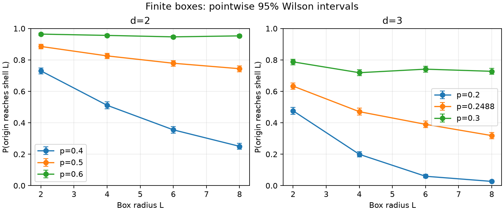

# Finite-size percolation

Run status: complete.

Finite reference diagnostic only; no theorem, ridge, exponent, or CWT validation. The approximate 3D reference cannot evaluate the exact-critical theorem. Wilson95 intervals are pointwise; finite radius and sampling noise limit inference. Real square-root encoding has zero Berry curvature; no smoothing or ridge fitting.

The source theorem is θ(p_c)=0 for independent nearest-neighbor bond percolation on Z^d, d≥2. Newly resolved dimensions are 3–10; the 2D case was known. It gives neither exact 3D thresholds nor critical exponents.

[Pinned primary release](https://github.com/anthropics/formal-math/blob/795efb86f191735c5481675763537cfb4ff37e55/percolation/README.md) reports machine/kernel verification. It did not claim independent human review; this benchmark did not rerun the formal proof.

2D p_c=0.5 is exact. The 3D reference ≈0.2488 is a numerical approximation, so this scan cannot test the exact-critical theorem. [Numerical reference](https://doi.org/10.1103/PhysRevE.87.052107).

Recorded 24/24 configurations. Frozen [protocol](protocol.json) SHA256: `1231626895430ff06cccb780745713310bb811c32171658b90c1b684d3cb5345`; archived before sampling.

Independent nearest-neighbor Bernoulli bonds in nonperiodic [-L,L]^d; no site damage
Origin cluster reaches Chebyshev shell L
sqrt(raw P(R=r)), r=0..L; phase zero
u on axis0; v on other axes; corners (p,p),(p+h,p),(p+h,p+h),(p,p+h)
SHA256(base,d,L,p.hex,stream,batch)->PCG64; measurement batch0; independent geometry
Within each geometry batch, reuse a full independent-edge uniform array across corners

Frozen sample profile:

```json
{"batches": 5, "dimensions": [2, 3], "geometry_samples": 2048, "min_overlap": 0.9, "probabilities_2d": [0.4, 0.5, 0.6], "probabilities_3d": [0.2, 0.2488, 0.3], "radii": [2, 4, 6, 8], "samples": 2048, "seed": 20261002, "step": 0.02}
```

Each rate has a pointwise Wilson95 interval from raw hits/trials; these are not simultaneous bands. Geometry uses independent batch streams and no smoothing. Real states have zero Ω; a nonzero metric measures encoding sensitivity. Ranges across accepted batches show sampling variation, not metric confidence intervals. Exclusions remain in [full raw records](records.json).



| d | L | p | hits/trials | rate | Wilson95 | Accepted batches | tr(g) range | Ω range | exclusions |
| --- | --- | --- | --- | --- | --- | --- | --- | --- | --- |
| 2 | 2 | 0.4 | 1496/2048 | 0.73047 | [0.71083, 0.74924] | 5/5 | 1.58746–2.94063 | 0–0 | {} |
| 2 | 2 | 0.5 | 1814/2048 | 0.88574 | [0.87124, 0.89880] | 5/5 | 1.3272–2.65826 | 0–0 | {} |
| 2 | 2 | 0.6 | 1975/2048 | 0.96436 | [0.95542, 0.97156] | 5/5 | 0.71236–1.56332 | 0–0 | {} |
| 2 | 4 | 0.4 | 1047/2048 | 0.51123 | [0.48958, 0.53284] | 5/5 | 5.87521–8.4099 | 0–0 | {} |
| 2 | 4 | 0.5 | 1691/2048 | 0.82568 | [0.80865, 0.84150] | 5/5 | 3.16174–8.20517 | 0–0 | {} |
| 2 | 4 | 0.6 | 1958/2048 | 0.95605 | [0.94629, 0.96411] | 5/5 | 1.53259–2.30436 | 0–0 | {} |
| 2 | 6 | 0.4 | 727/2048 | 0.35498 | [0.33455, 0.37596] | 5/5 | 10.552–15.9172 | 0–0 | {} |
| 2 | 6 | 0.5 | 1595/2048 | 0.77881 | [0.76032, 0.79625] | 5/5 | 6.58959–8.9789 | 0–0 | {} |
| 2 | 6 | 0.6 | 1939/2048 | 0.94678 | [0.93619, 0.95569] | 1/5 | 1.73699–1.73699 | 0–0 | {'zero_bin': 4} |
| 2 | 8 | 0.4 | 512/2048 | 0.25000 | [0.23173, 0.26921] | 5/5 | 13.6297–19.9885 | 0–0 | {} |
| 2 | 8 | 0.5 | 1524/2048 | 0.74414 | [0.72480, 0.76257] | 5/5 | 7.49752–14.2471 | 0–0 | {} |
| 2 | 8 | 0.6 | 1952/2048 | 0.95312 | [0.94309, 0.96146] | 0/5 | excluded | excluded | {'zero_bin': 5} |
| 3 | 2 | 0.2 | 975/2048 | 0.47607 | [0.45451, 0.49773] | 5/5 | 6.13643–11.6182 | 0–0 | {} |
| 3 | 2 | 0.2488 | 1297/2048 | 0.63330 | [0.61220, 0.65390] | 5/5 | 5.98896–7.31603 | 0–0 | {} |
| 3 | 2 | 0.3 | 1613/2048 | 0.78760 | [0.76935, 0.80476] | 5/5 | 3.56501–4.68098 | 0–0 | {} |
| 3 | 4 | 0.2 | 408/2048 | 0.19922 | [0.18249, 0.21707] | 5/5 | 20.593–27.1443 | 0–0 | {} |
| 3 | 4 | 0.2488 | 964/2048 | 0.47070 | [0.44916, 0.49236] | 5/5 | 15.9947–22.6995 | 0–0 | {} |
| 3 | 4 | 0.3 | 1472/2048 | 0.71875 | [0.69888, 0.73780] | 5/5 | 6.95733–14.0514 | 0–0 | {} |
| 3 | 6 | 0.2 | 122/2048 | 0.05957 | [0.05012, 0.07067] | 5/5 | 28.4594–47.5586 | 0–0 | {} |
| 3 | 6 | 0.2488 | 799/2048 | 0.39014 | [0.36924, 0.41145] | 5/5 | 34.3017–50.5786 | 0–0 | {} |
| 3 | 6 | 0.3 | 1518/2048 | 0.74121 | [0.72180, 0.75972] | 3/5 | 13.8844–20.9085 | 0–0 | {'zero_bin': 2} |
| 3 | 8 | 0.2 | 55/2048 | 0.02686 | [0.02069, 0.03479] | 5/5 | 37.8954–49.5552 | 0–0 | {} |
| 3 | 8 | 0.2488 | 652/2048 | 0.31836 | [0.29854, 0.33886] | 5/5 | 57.969–82.3803 | 0–0 | {} |
| 3 | 8 | 0.3 | 1490/2048 | 0.72754 | [0.70784, 0.74638] | 1/5 | 20.1046–20.1046 | 0–0 | {'zero_bin': 4} |

Exclusion reasons: chart_outside_open_domain, zero_bin, low_overlap, nonfinite_estimator. Per-corner raw histograms/support, actual/requested counts, overlap, and batch seeds are retained.

Exact controls use the same encoding on the lattice-embedded chain (0,0)→(1,0)→(1,1)→(1,2): q=[1-u,u(1-v²),uv²], u=.4, v=.6, h=.0001. The metric has two positive diagonal entries and Ω=0.

| tensor element | analytic | CGT estimator |
| --- | --- | --- |
| g_uu | 1.0416667 | 1.0416233 |
| g_uv | 0 | -3.9065348e-05 |
| g_vv | 0.625 | 0.6250586 |
| omega | 0 | 0 |

Additive gluing: independent four-edge diamond, exhaustive 16 configurations. Weights [0.8, 0.6, 0.9, 0.7]; P(o↔b)=0.8376, P(o↔A)=0.92, t=max_a P(a↮b)=0.1704; lower bound=0.7496, slack=0.088, passed=True. This finite correctness check is not a general proof. [Control details](controls.json).

Source commit `8561da5bb1680f2510b4da2d59608c3d27808eaf`; source dirty=False. [Provenance](provenance.json) includes source SHA256 values and pre-output Git status.

```text
(clean)
```

Python 3.12.14; versions: {"matplotlib": "3.11.2", "networkx": "3.7", "numpy": "2.5.3", "pandas": "3.0.6", "scipy": "1.18.1", "typer": "0.27.2"}.
[Artifact checksums](CHECKSUMS.json) include STATUS.json and retained files except this manifest.
