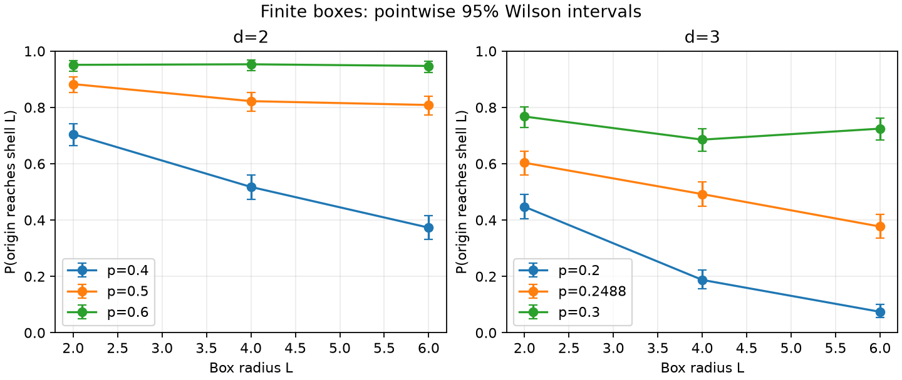

# Finite-size percolation

Run status: complete.

Finite reference diagnostic only; no theorem, ridge, exponent, or CWT validation. The approximate 3D reference cannot evaluate the exact-critical theorem. Wilson95 intervals are pointwise; finite radius and sampling noise limit inference. Real square-root encoding has zero Berry curvature; no smoothing or ridge fitting.

The source theorem is θ(p_c)=0 for independent nearest-neighbor bond percolation on Z^d, d≥2. Newly resolved dimensions are 3–10; the 2D case was known. It gives neither exact 3D thresholds nor critical exponents.

[Pinned primary release](https://github.com/anthropics/formal-math/blob/795efb86f191735c5481675763537cfb4ff37e55/percolation/README.md) reports machine/kernel verification. It did not claim independent human review; this benchmark did not rerun the formal proof.

2D p_c=0.5 is exact. The 3D reference ≈0.2488 is a numerical approximation, so this scan cannot test the exact-critical theorem. [Numerical reference](https://doi.org/10.1103/PhysRevE.87.052107).

Recorded 18/18 configurations. Frozen [protocol](protocol.json) SHA256: `80744642d3b5611d716ab00392dfea37ce705ae45fa783dd98393c973bb43af8`; archived before sampling.

Independent nearest-neighbor Bernoulli bonds in nonperiodic [-L,L]^d; no site damage
Origin cluster reaches Chebyshev shell L
sqrt(raw P(R=r)), r=0..L; phase zero
u on axis0; v on other axes; corners (p,p),(p+h,p),(p+h,p+h),(p,p+h)
SHA256(base,d,L,p.hex,stream,batch)->PCG64; measurement batch0; independent geometry
Within each geometry batch, reuse a full independent-edge uniform array across corners

Frozen sample profile:

```json
{"batches": 3, "dimensions": [2, 3], "geometry_samples": 512, "min_overlap": 0.9, "probabilities_2d": [0.4, 0.5, 0.6], "probabilities_3d": [0.2, 0.2488, 0.3], "radii": [2, 4, 6], "samples": 512, "seed": 20261001, "step": 0.02}
```

Each rate has a pointwise Wilson95 interval from raw hits/trials; these are not simultaneous bands. Geometry uses independent batch streams and no smoothing. Real states have zero Ω; a nonzero metric measures encoding sensitivity. Ranges across accepted batches show sampling variation, not metric confidence intervals. Exclusions remain in [full raw records](records.json).



| d | L | p | hits/trials | rate | Wilson95 | Accepted batches | tr(g) range | Ω range | exclusions |
| --- | --- | --- | --- | --- | --- | --- | --- | --- | --- |
| 2 | 2 | 0.4 | 361/512 | 0.70508 | [0.66417, 0.74293] | 3/3 | 1.50761–2.7717 | 0–0 | {} |
| 2 | 2 | 0.5 | 452/512 | 0.88281 | [0.85206, 0.90786] | 3/3 | 0.77267–4.42943 | 0–0 | {} |
| 2 | 2 | 0.6 | 487/512 | 0.95117 | [0.92891, 0.96671] | 3/3 | 1.13692–1.87891 | 0–0 | {} |
| 2 | 4 | 0.4 | 265/512 | 0.51758 | [0.47433, 0.56057] | 3/3 | 9.21724–14.2724 | 0–0 | {} |
| 2 | 4 | 0.5 | 421/512 | 0.82227 | [0.78679, 0.85294] | 3/3 | 4.05108–8.4612 | 0–0 | {} |
| 2 | 4 | 0.6 | 488/512 | 0.95312 | [0.93120, 0.96830] | 0/3 | excluded | excluded | {'zero_bin': 3} |
| 2 | 6 | 0.4 | 191/512 | 0.37305 | [0.33225, 0.41574] | 3/3 | 13.4701–15.7911 | 0–0 | {} |
| 2 | 6 | 0.5 | 414/512 | 0.80859 | [0.77227, 0.84032] | 3/3 | 11.6883–14.5281 | 0–0 | {} |
| 2 | 6 | 0.6 | 485/512 | 0.94727 | [0.92436, 0.96351] | 0/3 | excluded | excluded | {'zero_bin': 3} |
| 3 | 2 | 0.2 | 229/512 | 0.44727 | [0.40475, 0.49057] | 3/3 | 5.93472–9.40251 | 0–0 | {} |
| 3 | 2 | 0.2488 | 309/512 | 0.60352 | [0.56052, 0.64496] | 3/3 | 4.6961–6.63265 | 0–0 | {} |
| 3 | 2 | 0.3 | 393/512 | 0.76758 | [0.72908, 0.80209] | 3/3 | 1.5755–8.29608 | 0–0 | {} |
| 3 | 4 | 0.2 | 96/512 | 0.18750 | [0.15606, 0.22359] | 3/3 | 20.8631–40.1568 | 0–0 | {} |
| 3 | 4 | 0.2488 | 252/512 | 0.49219 | [0.44910, 0.53539] | 3/3 | 12.7199–29.7549 | 0–0 | {} |
| 3 | 4 | 0.3 | 351/512 | 0.68555 | [0.64407, 0.72426] | 3/3 | 14.1961–25.2924 | 0–0 | {} |
| 3 | 6 | 0.2 | 38/512 | 0.07422 | [0.05455, 0.10023] | 3/3 | 33.6459–48.4706 | 0–0 | {} |
| 3 | 6 | 0.2488 | 193/512 | 0.37695 | [0.33604, 0.41970] | 3/3 | 41.8208–60.5366 | 0–0 | {} |
| 3 | 6 | 0.3 | 371/512 | 0.72461 | [0.68435, 0.76152] | 0/3 | excluded | excluded | {'zero_bin': 3} |

Exclusion reasons: chart_outside_open_domain, zero_bin, low_overlap, nonfinite_estimator. Per-corner raw histograms/support, actual/requested counts, overlap, and batch seeds are retained.

Exact controls use the same encoding on the lattice-embedded chain (0,0)→(1,0)→(1,1)→(1,2): q=[1-u,u(1-v²),uv²], u=.4, v=.6, h=.0001. The metric has two positive diagonal entries and Ω=0.

| tensor element | analytic | CGT estimator |
| --- | --- | --- |
| g_uu | 1.0416667 | 1.0416233 |
| g_uv | 0 | -3.9065348e-05 |
| g_vv | 0.625 | 0.6250586 |
| omega | 0 | 0 |

Additive gluing: independent four-edge diamond, exhaustive 16 configurations. Weights [0.8, 0.6, 0.9, 0.7]; P(o↔b)=0.8376, P(o↔A)=0.92, t=max_a P(a↮b)=0.1704; lower bound=0.7496, slack=0.088, passed=True. This finite correctness check is not a general proof. [Control details](controls.json).

Source commit `b8a1245e3932966e6d2e15bd4b78761139ba7f20`; source dirty=False. [Provenance](provenance.json) includes source SHA256 values and pre-output Git status.

```text
(clean)
```

Python 3.12.14; versions: {"matplotlib": "3.11.2", "networkx": "3.7", "numpy": "2.5.3", "pandas": "3.0.6", "scipy": "1.18.1", "typer": "0.27.2"}.
[Artifact checksums](CHECKSUMS.json) include STATUS.json and retained files except this manifest.
